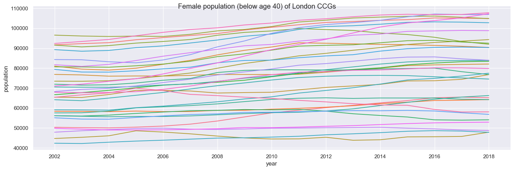
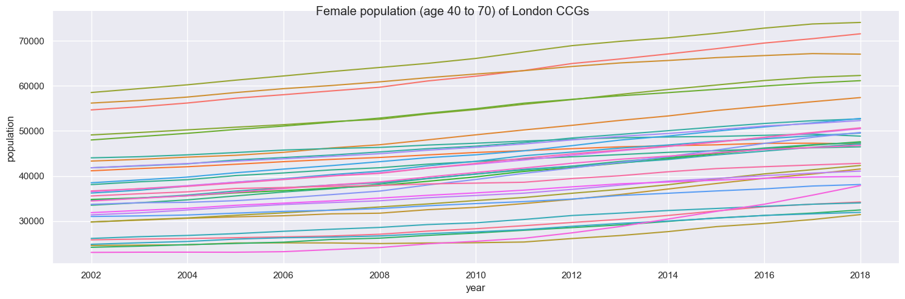
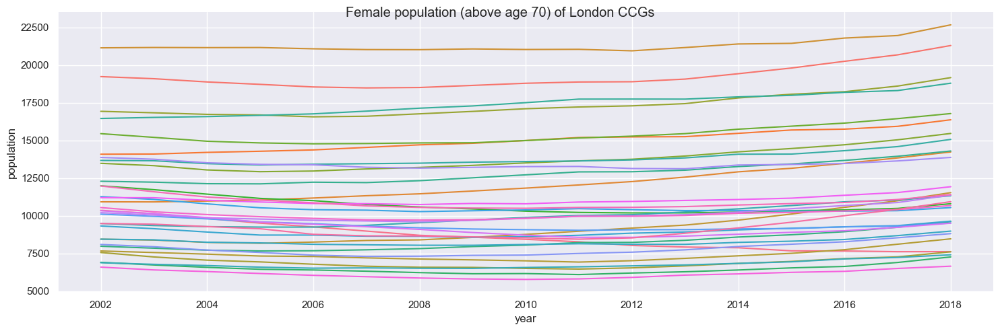

Plots female populations of London Clinical Commissioning Groups (CCGs) by ages grouped into:
- below age 40
- between ages 40 - 70
- above age 70

These age groups were chosen to reflect breast cancer risk distribution and enable anonymity of patient data.

