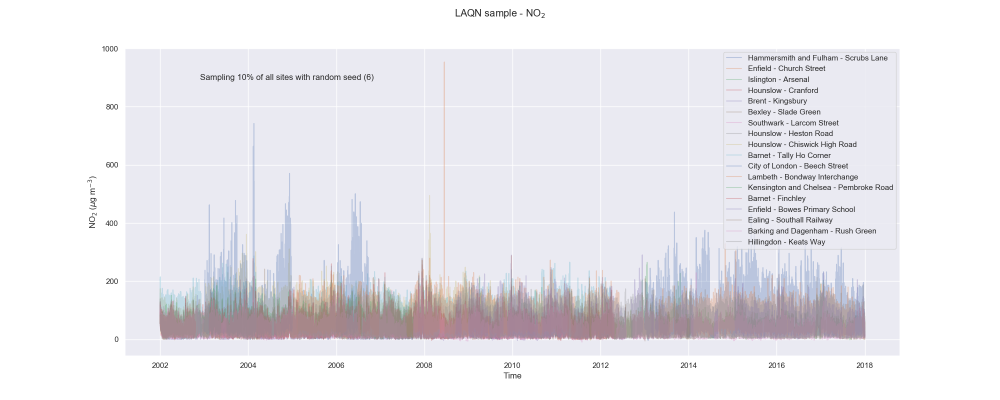
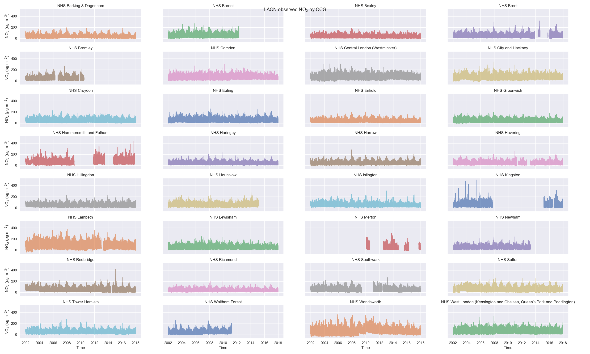
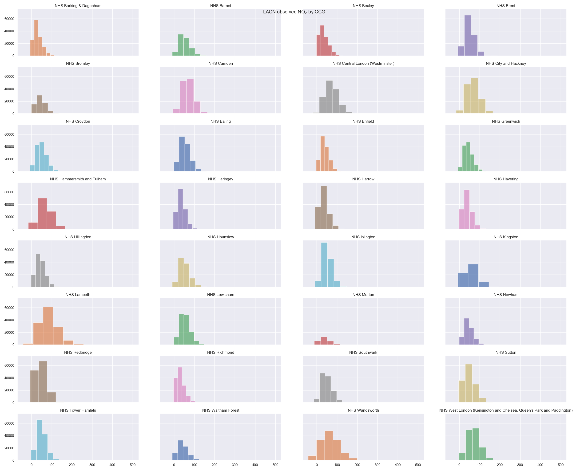

Multiple options for data plotting:

- Plot a fractional random sample of LAQN sites. Fraction and random seed can be specified.

- Plot the CCG-averaged LAQN data as time series

- Plot the CCG-averaged LAQN data as histograms

