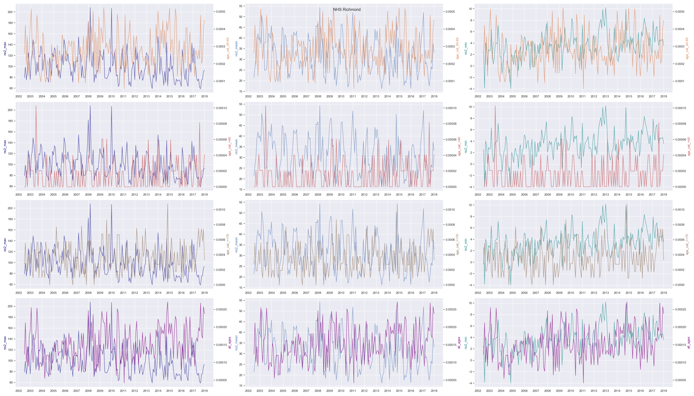

Exploration for 2 example CCGs, using each age category and each monthly statistic.

### Age categories:
- Below 40
- 40 to 69
- 70 and above

### Monthly statistics:
- Mean
- Minimum
- Maximum

## NHS Central London (Westminster)
(An example of high emissions in London.)
.png)

## NHS Richmond
(An example of low emissions in London.)

